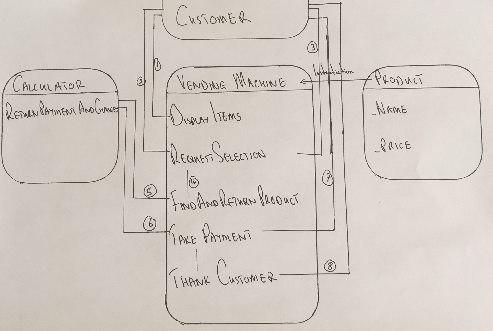

# Vending-Machine-Project

### Description
This is a C# solution for a vending machine that accepts only 50p coins. It is however able to dispense correct change in other denominations.

- The vending machine allows customers to request a product (or products) and deposit the correct number of 50p coins.

- The vending machine must respond to show that the correct product is provided along with the correct change.

### Configuration
- This Console Application is built using Visual Studio Community.
run `Program.cs` for the interactive app.

### Design
I separated the responsibilities of the vending machine project into three classes - Vending Machine, Product and Calculator. They are described below.

### Vending Machine Class
* Responsible for interacting with the customer.

| Function  | Responsibility |
| ------ | ----------- |
| `void DisplayItems()` | Outputs a line to the console for each product in its its inventory displaying the product name and product price. The inventory exists as an items array. |
| `char RequestSelection()` | A list is created to hold product information which will be matched against customer input. A foreach loop is run. Dynamically, the first letter of the name of each product available is added to the list. Simultaneously, a line is output to the console requesting that that letter be used to request that product. Customer input is received and converted to a char from a string. A char is returned by this method to be passed to the `FindAndReturnProduct()` function. |
| `Product FindAndReturnProduct(char selection)` | The character representing the product choice of the customer is matched to a product in the items array of the vending machine. The `Array.find()` function is applied here. This function returns the product object. |
| `void TakePayment(double coinsRequired, double change, Product product)` | The calculator class has a function that will return the number of coins required and and the change necessary. This function will request the customer to enter their payment. It will receive 50p coins until the number received matches the number stipulated by the calculator class. It will then call `ThankCustomer()`. |
| `void ThankCustomer(paymentReceived, product.Name, change)` | This method clarifies the entire operation. It informs the customer of their purchase success. That they get their product and the correct change owed. |

### Calculator Class
* Responsible for providing necessary payment information.

| Function  | Responsibility |
| ------ | ----------- |
| `double[] ReturnPaymentAndChange(double productPrice)` | Passed only the price of the item, this method returns the number of 50p coins necessary for purchase and the corresponding change necessary. It executes a `Math.Ceiling()` function and a simple subtraction to calculate necessary change. These two doubles are returned as an array and passed to the Vending Machine `TakePayment()` function.  |

### Product Class
* Responsible for encapsulation of the attributes of items that can be purchased by customers.

| Attribute  | Responsibility |
| ------ | ----------- |
| Name | The display name of the given product. |
| Price | The payment necessary for the purchase of the given product. |

#### Considerations
- Wrong Coins being inserted:
  - the vending machine can accept only 50p coins. I had to program to allow the vending machine to determine when it had been fed an incorrect coin and not allow that coin to contribute towards the accumulated total. I did this using a while loop and a try-catch block for string input exceptions.
- Incorrect product requests:
  - the vending machine dispenses only two products, but I believe it prudent for incorrect product requests to be handled appropriately. If a customer enters a character which does not correspond to a product i.e. that character is not found in the list of characters representing available products, then an appropriate response is generated. The customer is asked to make their request again. I did this using a while loop and an `!list.Contains(selection)` condition.
- The List created in `vendingMachine.RequestSelection()` is dynamic. It is formed during the code execution and requires no modification to accommodate greater or fewer products. It completely open for extension simply by adding more products to the Vending Machine items array.
  - if it were the case that two product names began with the same letter then I would use the first two letters to represent the product. I would then correspondingly prompt the customer to enter the first two letters of the product name that they wish to purchase.

#### Further Developments
I would like to extract the product inventory out to a separate class. This would allow for manipulation of product quantities without disruption to the vending machine class. I may do this by instantiating a vending machine with an attribute which directly references an Inventory Object.
